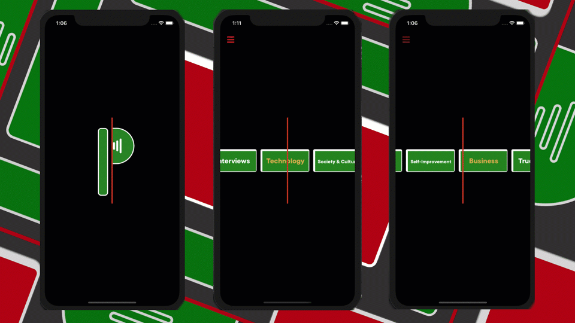
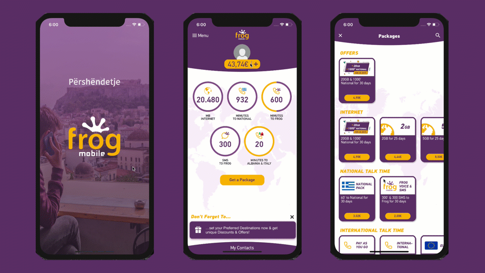
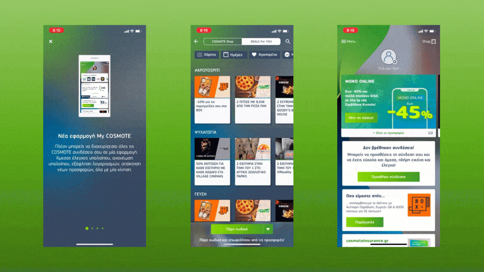
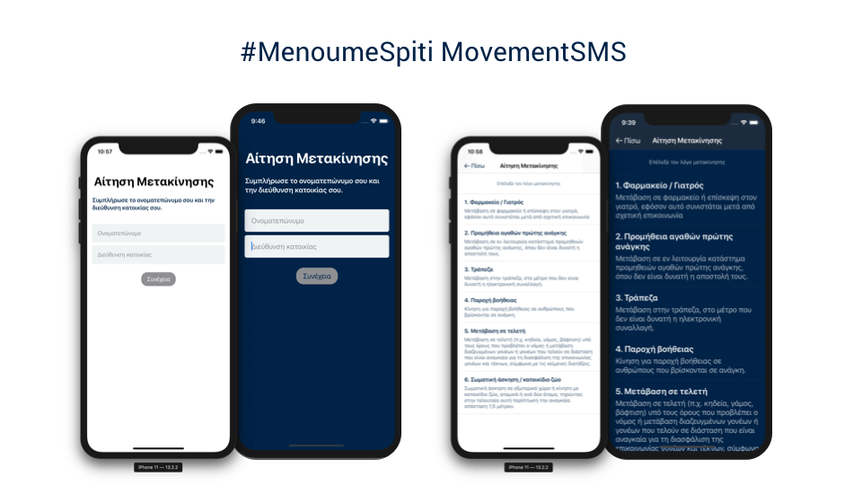
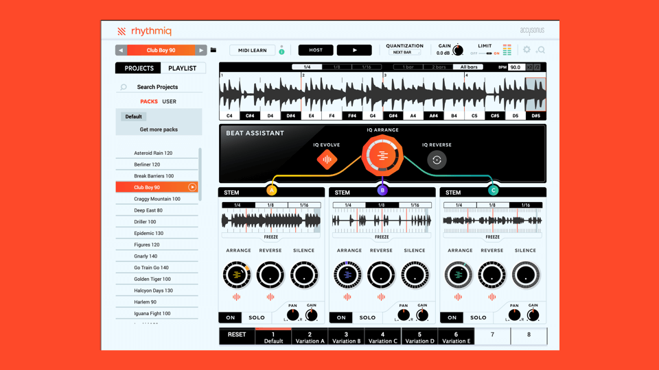
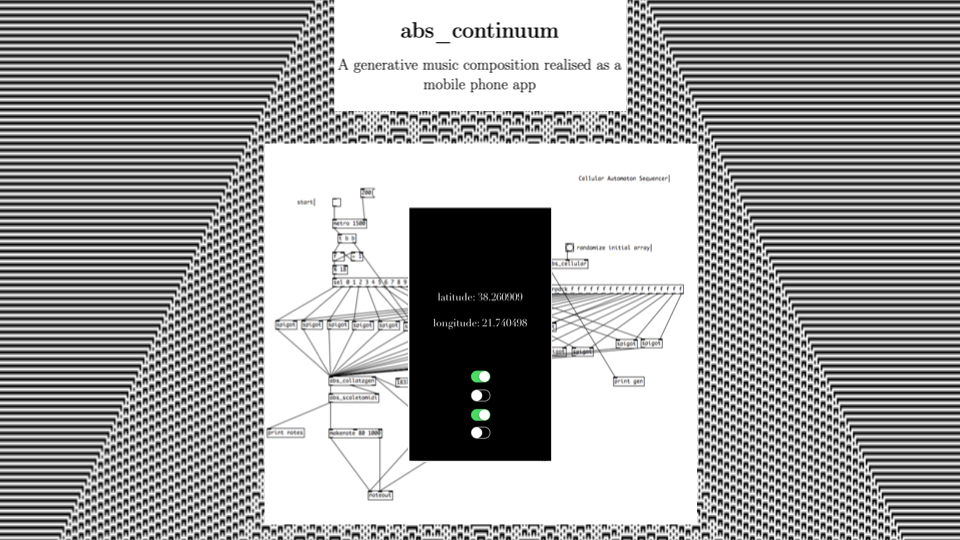

## Podfast

Role: Creator, Software Developer

Platform: iOS

[Github](https://github.com/orjpap/podfast)

### Technologies

* iOS
* Audio Streaming
* RSS
* Firebase Remote Config
* Firebase Analytics
* Realm

---

## What's Up

Platform: iOS/Android

Role: Software Developer (iOS), Technical Project Manager

### Technologies

* iOS
* Firebase Analytics
* AppCenter Builds
* Alamofire
* Realm

---

## Frog

Platform: iOS/Android

Role: Software Developer (iOS), Technical Project Manager

### Technologies

* iOS
* Firebase Analytics
* AppCenter Builds
* Alamofire
* Realm

---

## My Cosmote

Platform: iOS/Android

Role: Software Developer (iOS)

### Technologies

* iOS
* Firebase Analytics
* AppCenter Builds
* Alamofire
* Realm

---

## #MenoumeSpiti MovementSMS

Platform: iOS

Role: Creator, Software Developer

[Github](https://github.com/orjpap/MenoumeSpiti-MovementSMS)

### Technologies

* SwiftUI
* Firebase Remote Config

---

## Accusonus Rhythmiq

Platform: Windows/Mac available as AU/VST/VST3 Plugin

Role: Software Developer

### Technologies

* C++
* Eigen
* JUCE
* MIDI
* Jenkins

---

## Abs_Continuum

Platform: iOS

Role: Creator, Software Developer

### Technologies

* Objective-C
* Procedural/Generative Audio
* Pure Data
* libpd for iOS